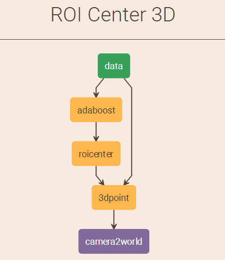
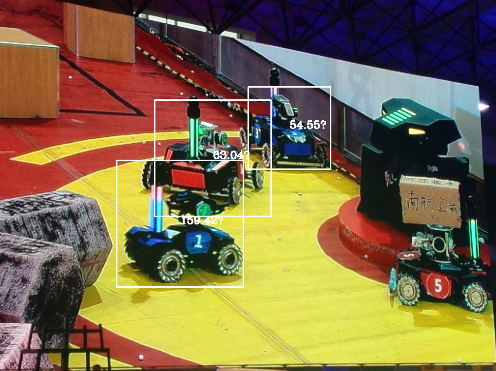
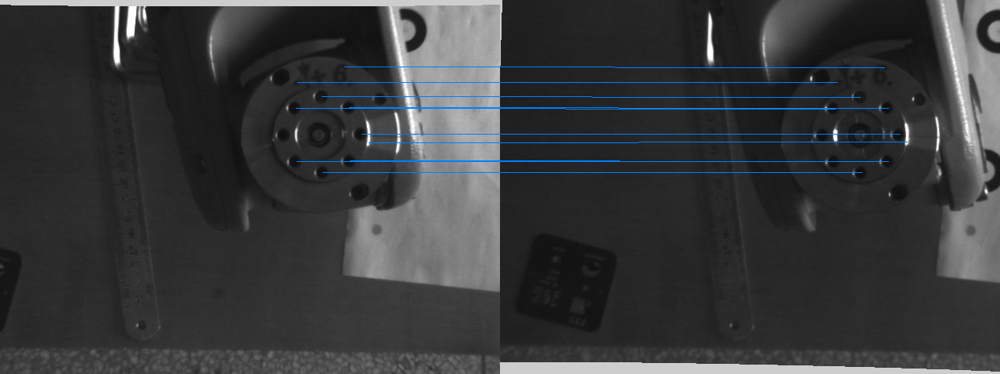
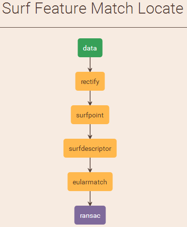
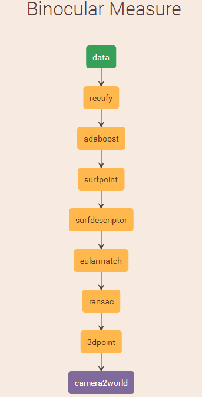
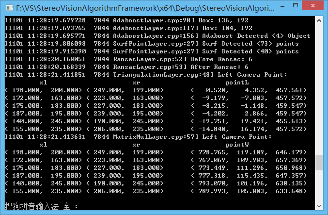

SVAF
===
Svaf
---
Svaf:Stereo Vision Algorithm Framework.
Svaf采用简洁的配置文件组织算法，目前包含以下模块：

* 统一视频图像输入接口
* 图像处理算法
* 目标识别算法
* 目标跟踪算法
* 特征点提取算法
* 立体匹配算法
* 点云重建算法
* 点云配准算法
* 数据记录和表格输出

目前Svaf仅由个人维护，仅支持Windows平台。任何Svaf源码的使用都需要遵守BSD2相关开源许可。

Why Svaf
---
立体视觉算法模块众多，参数复杂，为了更方便进行双目立体视觉算法的研究和开发，于是将各种算法通过配置文件组织起来。Svaf设计上参考了Caffe，将不同算法模块封装成层，通过配置文件将将各个层链接起来，在运行时算法就会按照规定的路径运行。

Savf适合双目立体视觉的开发者，如果你拥有多个相机，那么Svaf也能良好工作，只是其中某些模块的处理结果并非你所期望的，开发者正试图将Svaf推向拥有三个及以上相机的系统。

Installation instructions
---
### 开发环境

* __Visual Studio__ 

    要求VS2012及以上，推荐版本VS2013，开发者使用的是VS2013

* __OpenCV__ 

    要求OpenCV版本2.4以上，推荐版本2.4.13，OpenCV3.1很久没更新了，并不推荐
* __ProtoBuf__

    需要下载源码自行编译。推荐版本2.6以上，如果你使用的是3.0以上版本，那么在书写算法配置时，需要在开头注明`syntax = "proto2";`
    protocolbuffer是google的一种数据交换格式，在本程序中被用来管理算法参数

* __Glog__

    需要下载源码自行编译。可以下载到的版本都可以(这个也是很久没更新了)，Glogs在本程序中用来输出日志文件以及检查参数
* __Gflags__

    需要下载源码自行编译。推荐版本2.0及以上，Gflags用于命令行参数解析

* __Matlab__

    版本7.5及以上，推荐Matlab2012a及以上
* __Intel Compiler__

    可选择，是否安装Intel的编译器。一般来说Intel的编译器更加优秀，编译出的代码运行速度更快，版本12及以上，开发者使用的是Inter Compiler 16.0，如果你使用VS自带编译器。

* __PCL__

    PCL版本1.7.2及以上，推荐版本1.8.0版本。PCL点云库用来处理点云数据，并提供点云结果的可视化输出。

### 配置过程

1. __开始__

    下载源码，用Visual Studio打开工程，右键解决方案中的StereoVisionAlgorithmFramework工程，点击`属性`打开工程属性窗口
2. __配置OpenCV__

    编译好opencv之后，在环境变量中添加`OPENCV_ROOT`项，值为`D:\opencv\build`(opencv路径)，然后属性表会自动加载。
    如果选择不使用属性表，也可以自己配置include目录、lib目录、link库列表，也可以使用`#pragma comment(lib, 'opencv_XXX_2413.lib')`来进行链接。如果是动态库，那么还需要在系统的环境变量中加入bin目录，以调用dll。
    这里需要表明，如果这里采用动态库，那么在编译下面三个库时，请编译相应的动态库，如果你调用的是OpenCV的静态库，那么在项目属性页面中修改`C++ -> CodeGeneration -> RunTime Libraty: = /MT`,于是在后面编译protobuf、glog和gflags的时候，就也需要做同样的设置。

3. __配置Protobuf__

    下载protobuf源码，使用cmake生成VS工程。进入VS后设置生成选项，这里的设置(x86,x64,debug,release,/MT,/MD)要和后面几个库统一。将编译好的lib、dll以及目录下本来就存在的.h头文件提取出来。在项目工程中加入include目录，lib目录，并设置链接库。
    
4. __配置Gflags__

    同Protobuf配置过程类似，需要自行下载源码编译。
5. __配置Glog__

    与Protobuf配置过程类似，需要自行下载源码编译。
    在工程中包含目录include时，include的子目录应有如下结构

        include/google/protobuf
        include/opencv
        include/opencv2
        include/glog
        include/gflags
    这样就只需要包含include一个文件夹了，并且特别注意，protobuf的上一层一定要有google这个目录
6. __配置Matlab__

	为了方便直接调用属性表，我们增加一个环境变量`MATLAB_ROOT`，值为`D:\Program Files\MATLAB\R2017a`
    由于Svaf中一些模块调用了Matlab，所以需要在程序中设置Matlab的include目录和lib目录。
    点开属性页面，设置include目录为`MATLAB_ROOT/extern/include`，32位开发环境设置lib目录为`MATLAB_ROOT/extern/lib/win32/microsoft`，64位开发环境设置lib目录为`MATLAB_ROOT/extern/lib/win64/microsoft`(如果调用了属性表，这几项会自动加载)。
    由于如下代码已经在Svaf工程中添加，所以无需再设置链接Matlab库。

        #pragma comment(lib, 'libeng.lib')
        #pragma comment(lib, 'libmx.lib')
        #pragma comment(lib, 'libmat.lib')
        #pragma comment(lib, 'libmex.lib')
    最后需要在系统路径中添加环境变量`MATLAB_INSTALL_PATH/bin/win64`到Path中
7. __配置PCL库__

    使用OneInAll安装包配置PCL库，并添加SVAF提供的属性表直接配置PCL环境，对于Intel编译器需要另外编译Boost库。在安装PCL库之后，首先需要添加如下路径到系统环境变量

        %PCL_ROOT%\bin
        %OPENNI2_REDIST64% (or %OPENNI2_REDIST%)
        %PCL_ROOT%\3rdParty\FLANN\bin
        %PCL_ROOT%\3rdParty\VTK\bin
        %PCL_ROOT%\Qhull\bin
        %PCL_ROOT%\3rdParty\OpenNI2\Tools
    在VS中导入属性表之后，在编译程序时仍有可能报错，这是因为使用了许多第三方库。首先请务必开启C++11支持，如果你使用的是VS2013，请确保VS2013升级至Update5，否则在编译boost库相关部分时可能报错。如果同时使用OpenCV和PCL，那么flann库可能发生冲突，需要在报错的`flann`前面加上全局命名空间`::flann`，并且如果需要使用opencv的flann，那么需要使用`cv::flann`来进行空间声明。请务必启用NOMINMAX宏，防止stl库定义min和max，以防止其与STL中的min和max宏名冲突，当然，也可以手工在PCL头文件中max出现处添加括弧标识`(std::max)(a,b)`来避免编译器将max解释为宏。
8. __添加数据文件__

    [下载bgr2luv.dat文件](http://wp.p-chao.com/data/acf/bgr2luv.dat)，放置到`SVAF\bgr2luv.dat`和`\AcfDetect\bgr2luv.dat`。该文件是在目标检测时使用的色彩空间转换表，数据过大，不利于git提交和下载，所以分离出来单独下载。
    
### 编译过程

1. __Proto文件的编译__
    
    <pre>cd SVAF/svaf/
    protoc --cpp_out=./ svaf.proto</pre>
    或者直接运行`SVAF/svaf/build.bat`

### 辅助工具
1. [__Camera Calibration Toolbox for Matlab__](http://www.vision.caltech.edu/bouguetj/calib_doc/index.html)

    这个工具箱实现了张正友法相机标定，Svaf和标定相关模块的参数需要该工具箱进行离线标定
2. [__Piotr's Computer Vision Toolbox__](https://pdollar.github.io/toolbox/)

    Svaf中的Adaboost模块采用该工具箱中的算法，使用该工具箱进行离线训练
3. [__Netscope__](http://ethereon.github.io/netscope/#/editor)

    把该工程算法的配置文件粘贴到这个页面，使用#注释掉第一个bottom `#bottom: "data"` 可以自动生成算法的框架图哦。
    

Examples
---
* __目标识别__

    detect.pbf:
    
		# configure text
		name:	 "adaboost detect"
		version: "v0.1"
		layer{
			name:	"data"
			type:	IMAGE
			bottom: "data"
			top:	"adaboost"
			imagedata_param{
				name:	"F:/VS/StereoVisionAlgorithmFramework/AcfDetect/a.jpg"
				name:	"F:/VS/StereoVisionAlgorithmFramework/AcfDetect/b.jpg" #可以按顺序处理多张图片
			}
		}
		layer{
			name:	"adaboost"
			type:	ADABOOST
			bottom:	"data"
			top:	"adaboost"
			adaboost_param{
				detector:	"F:/VS/StereoVisionAlgorithmFramework/AcfDetect/acfCarDetector.dat" #利用工具箱训练得到的分类器
				thresh:		40 #分类时检测的阈值
			}
		}
    结果输出有三种类型，一种是日志信息，另一种是图像显示，还有就是对某些模块，一些参数会输出到特定设备。运行以上文件时，算法使用一个分类器检测一个目标，输入如下结果
    

    同时以下是log目录下的日志文件

    	Log file created at: 2016/11/01 10:36:05
		Running on machine: PC
		Log line format: [IWEF]mmdd hh:mm:ss.uuuuuu threadid file:line] msg
		I1101 10:36:05.182090  4536 main.cpp:21] Svaf Copyright(c) 2016, Peng Chao
		...
		I1101 10:36:05.273578  4536 Circuit.cpp:45] data -> 
		I1101 10:36:05.274580  4536 Circuit.cpp:59]  -> adaboost
		I1101 10:36:05.275583  4536 Circuit.cpp:53] Build All Layers.
		I1101 10:36:05.276588  4536 Circuit.cpp:153] Layer [data] Builded.
		I1101 10:36:05.277590  4536 Circuit.cpp:153] Layer [adaboost] Builded.
		I1101 10:36:05.307694  4536 Param.cpp:179] Fetched Image:
		F:/VS/StereoVisionAlgorithmFramework/AcfDetect/a.jpg
		I1101 10:36:05.773938  4536 AdaboostLayer.cpp:156] Adaboost Detected <4> Object
		I1101 10:36:05.774938  4536 AdaboostLayer.cpp:77] Box: 332.5, 261.253
		...
		I1101 10:36:44.429144  4536 main.cpp:28] Done.

* __特征匹配__

    `StereoVisionAlgorithmFramework/svaf/surfmatchwithransac.pbf`
    

    该配置文件粘贴到NetScope上可以生成如下网络结构图(粘贴时注意注释掉第一个bottom哦)
    

		# configure text
		name:	"Surf Feature Match Locate"
		version: "v0.1"
		layer{
			name:	"data"
			type:	IMAGE_PAIR
			bottom: "data"
			top:	"rectify"
			imagepair_param{
				pair{
					left: "F:/MATLAB/left/I01.bmp"
					right: "F:/MATLAB/right/I01.bmp"
				}
			}
		}
		layer{
			name:	"rectify"
			type:	RECTIFY # 立体校正
			top:	"surfpoint"
			rectify_param{
				filename:	"F:/MATLAB/calibration/rectify.dat" # Matlab工具箱生成的校正矩阵
			}
		}
		layer{
			name:	"surfpoint"
			type:	SURF_POINT # Surf特征点检测
			bottom: "rectify"
			top:	"surfdescriptor"
			surfpoint_param{
				stride:		2
				octaves:	5
				intervals:	4
				thresh:		0.00005
			}
		}
		layer{
			name:	"surfdescriptor"
			type:	SURF_DESP # Surf特征描述
			bottom:	"surfpoint"
			top:	"eularmatch"
		}
		layer{
			name:	"eularmatch"
			type:	EULAR_MATCH # 欧氏距离筛选
			bottom:	"surfdescriptor"
			top:	"ransac"
			eularmatch_param{
				thresh:	0.65
			}
		}
		layer{
			name:	"ransac"
			type:	RANSAC # Ransac筛选匹配点
			bottom:	"eularmatch"
			top:	"ransac"
			ransac_param{
				thresh: 5.0
			}
		}

* __双目测量__

    `StereoVisionAlgorithmFramework/svaf/binocularlocate.pbf`
    该配置文件描述的算法具有如下结构
    

    最终控制台会输出检测出特征点的三维坐标：pointL是左相机坐标系的坐标，pointW是世界坐标系坐标
    

API Documentation
---
对应版本：v_1.21

* __Layer__

	所有层的基类，虚类，提供虚函数Run接口。提供时间统计函数，提供层名name，控制显示show，控制保存结果save，控制输出日志控制logi，logt等变量。

	<pre>
	message LayerParameter{
		optional string name = 1;
		optional string bottom = 2;
		optional string top = 3;
		optional bool	show = 4 [default = false];
		optional bool	save = 5 [default = false];
		optional bool	logt = 6 [default = false];
		optional bool	logi = 7 [default = false];
		enum LayerType{
			NONE = 0;
			IMAGE = 1;
			...
			RECTIFY = 141;
		}
		optional LayerType type = 10;
	}</pre>

* __AdaboostLayer__
	
	<pre>
	message AdaboostParameter{
		optional string detector = 1;
		optional bool	sync_frame = 2 [default = false];
		optional bool	sync_video = 3 [default = false];
		optional bool	sync_epipolar = 4 [default = false];
		optional float	thresh = 5 [default = 0];
		optional float	nms = 6 [default = 0.65];
		optional ROIExtention pad_rect = 7;
	}</pre>
	Adaboost层会自动剪裁图像，图像中置信度最高的区域会被作为ROI自动剪裁出来，同时，图像Block类中的 `roi` 会对应改变，Block中的 `roi` 永远都是相对于最初的图像，而Block类中的 `point` 则是相对当前图像的。
	Adaboost算法为双目版本提供极线约束优化，sync开启时，左右图像ROI大小相同，epipolar开启时，左右图像的roi在同一水平线上，此时形成极线约束。
    可以通过ROIExtention对检测结果进行调整（如上下平移，拓展边界等）
* __DataLayer__
	<pre>
	message DataParameter{
		optional bool color = 1;
	}</pre>

    数据层支持多种数据来源和格式，包括图像、视频、网络摄像头、图像文件夹、Kinect摄像头等，除此之外还有进程通信接口，可通过其它进程的内核映射对象获取数据。数据来源被封装在程序中，这一层仅仅控制图像的色彩通道是单通道还是三通道。
* __MatrixMulLayer__
	<pre>
	message MatrixMulParameter{
		optional string	filename = 1;
		optional string col0 = 2;
		optional string col1 = 3;
		optional string col2 = 4;
	}</pre>
	使用一个3*4矩阵，完成相机坐标系和世界坐标系间的转换。支持二进制文件和配置文件直接输出两种形式，二进制文件为matlab直接保存的格式。
* __MilTrackLayer__
	<pre>
	message MilTrackParameter{
		enum InitType{
			MOUSE = 1;
			SELECT = 2;
			AUTORECT = 3;
			ADABOOST = 4;
		}
		optional InitType init_type = 1 [default = AUTORECT];
		enum TrackType{
			MIL = 1;
			ADA = 2;

			MIL_GRAY = 11;
			MIL_RGB = 12;
			MIL_LUV = 13;
			MIL_HSV = 14;
		}
		optional TrackType track_type = 2 [default = MIL];
		optional int32 track_count = 3 [default = 20];
		repeated InitRectParameter init_rect = 4;
		optional uint32 tr_width = 5 [default = 200];
		optional uint32 tr_height = 6 [default = 150];
		optional float  scalefactor = 7 [default = 0.5];

		optional uint32 init_negnum = 11 [default = 65];
		optional uint32 negnum = 12 [default = 65];
		optional uint32 posmax = 13 [default = 100000];
		optional uint32 srchwinsz = 14 [default = 25];
		optional uint32 negsample_strat = 15 [default = 1];
		optional uint32 numfeat = 16 [default = 250];
		optional uint32 numsel = 17 [default = 50];
	
		optional float	lrate = 21 [default = 0.85];
		optional float	posrad = 22 [default = 1.0];
		optional float	init_posrad = 23 [default = 3.0];
		optional uint32 haarmin_rectnum = 24 [default = 2];
		optional uint32 haarmax_rectnum = 25 [default = 6];

		optional bool	uselogr = 29 [default = true];

		// only avaliable on binocular track
		optional bool	tss = 31 [default = false];
		optional bool	pool = 32 [default = false];
		optional bool	sync = 33 [default = false];
		optional bool	mixfeat = 34 [default = false];
		optional bool	showprob = 35 [default = false];
	}</pre>
    MIL图像跟踪，可以选择是手动框选目标，还是使用Adaboost自动框选目标，同时也可以选择是没格多少帧自动调用Adaboost算法进行目标检测。
* __BinoTrackLayer__

	_MILTrackLayer_的双目实例，参数表与_MILTrackLayer_相同

* __RansacLayer__
	<pre>
	message RansacParameter{
		optional float	thresh = 1 [default = 5];
	}</pre>
	使用Ransac算法筛选匹配点对，可以调整的参数为筛选阈值，一般需要在运行Ransac之前需要一个初匹配，防止计算量过大
* __StereoRectifyLayer__
	<pre>
	message StereoRectifyParameter{
		optional string filename = 1;
	}</pre>
	读取Matlab工具生成的映射表进行立体矫正
* __CVPointLayer__
	<pre>
	message CVPointParameter{
		enum PointType{
			FAST = 1;
			FASTX = 2;
			MSER = 3;
			ORB = 4;
			BRISK = 5;
			FREAK = 6;
			STAR = 7;
			SIFT = 8;
			SURF = 9;
			GFTT = 10;
			HARRIS = 11;
			DENSE = 12;
			SBLOB = 13;
			AKAZE = 14;
		}
		optional PointType	type = 1;
		optional bool		isadd = 2 [default = false];

		optional FastParamCP	fast_param	= 11;
		//optional FastParamCP	fastx_param = 12;
		optional MSERParamCP	mser_param	= 13;
		optional ORBParamCP		orb_param	= 14;
		optional BriskParamCP	brisk_param = 15;
		optional FreakParamCP	freak_param = 16;
		optional StarParamCP	star_param	= 17;
		optional SiftParamCP	sift_param	= 18;
		optional SurfParamCP	surf_param	= 19;
		optional GFTTParamCP	gftt_param	= 20;
		optional HarrisParamCP	harris_param = 21;
		optional DenseParamCP	dense_param = 22;
		optional SimpleBlobParamCP	sb_param = 23;
		optional AkazeParamCP	akaze_param = 24;
	}</pre>
    集成了OpenCV中9种特征点检测算法
* __CVDescriptorLayer__
	<pre>
	message CVDescriptorParameter{
		enum DespType{
			SIFT = 1;
			SURF = 2;
			BRIEF = 3;
			BRISK = 4;
			ORB = 5;
			FREAK = 6;
			OPPONENT = 7;
		}
		optional DespType type = 1;
		optional BriefDespCV brief_param = 2;
	}</pre>
    集成了OpenCV中多种特征描述子算法
* __CVMatchLayer__
	<pre>
	message CVMatchParameter{
		enum MatchType{
			BFL1 = 1;
			BFL2 = 2;
			BFH1 = 3;
			BFH2 = 4;
			FLANN = 5;
		}
		optional MatchType	type = 1;
		optional bool		crosscheck = 2 [default = true];
	}</pre>
    集成了OpenCV中2种特征匹配算法
* __SurfPointLayer__

	Surf特征点检测
* __SurfDescriptorLayer__

	对特征点进行Surf描述
* __StereoLayer__

    抽象立体层，其中封装了PCL点云库中的多种算法，用于需要处理点云数据的层来继承
* __TriangluarationLayer__
	<pre>
	message TriangularParameter{
		optional bool	visible = 1 [default = true];
		optional string toolbox_dir = 2;
		optional string calibmat_dir = 3;
		optional bool	savepc = 4 [default = false];
		optional string pcname = 5 [default = "./ref_pointcloud.pc"];
	}</pre>
	将左右相机的二维图像坐标，转换为相机世界坐标，调用Matlab实现，需要Matlab支持

* __CenterPointLayer__

	直接将目标检测中心位置作为最终结果进行输出，由于只是计算二维中心点，所以不需要额外参数，二维点映射三维坐标的任务交给其它层完成

* __EadpMatchLayer__
	<pre>
	message EADPMatchParameter{
		optional int32 max_disp = 1 [default = 24];
		optional int32 factor = 2 [default = 2560];
		optional int32 guidmr = 3 [default = 1];
		optional int32 dispmr = 4 [default = 1];
		optional float sg = 5 [default = -25.0];
		optional float sc = 6 [default = 25.5];
		optional float r1 = 7 [default = 10];
		optional float r2 = 8 [default = 500];
		optional string prefix = 9 [default = "./eadp"];
		optional bool	savetxt = 10 [default = false];
	}</pre>
	进行Eadp立体匹配，计算视差

* __SGMMatchLayer__
	<pre>
	message SGMMatchParameter{
		optional int32 max_disp = 1 [default = 24];
		optional int32 factor = 2 [default = 2560];
		optional int32 dispmr = 3 [default = 1];
		optional float r1 = 4 [default = 10];
		optional float r2 = 5 [default = 500];
		optional string prefix = 6 [default = "./sgm"];
		optional bool	savetxt = 7 [default = false];
	}</pre>
	进行SGM立体匹配，计算视差

* __SupixSegLayer__
	<pre>
	message SuperPixelSegmentParameter{
		optional int32 K = 1 [default = 400];
		optional int32 M = 2 [default = 10];
		optional bool optint = 3 [default = true];
		optional bool saveseg = 4 [default = false];
		optional string segname = 5 [default = "./supix.seg"];
	}</pre>
	进行超像素分割

Program Control
---
    在框架运行过程中，可以使用以下按键对算法进行暂停、退出、初始化等控制：
* Q: Quit
* E: Exit
* P: Pause
* R: Reinitiate

Updata Log
---
##### 2017/9/2 (v_1.22) #####
1. 增加点云初始配准层，支持输出欧拉角
2. 使用系统变量配置环境，完善配置说明
3. 增加BSD2开源协议
##### 2017/8/4 (v_1.21) #####
1. SVAF项目开源 [__RVAF__](https://github.com/P-Chao/RVAF)
2. 默认使用VS12编译环境和MATLAB2017a
3. 删除FeaturePoolLayer
4. 完善配置说明
##### 2016/12/20 (v_1.20) #####
1. 修复v_1.10版本以来，立体匹配算法的Bug
##### 2016/12/13 (v_1.19) #####
1. 增加logt控制是否记录时间，增加logi待用控制记录信息
2. 完善双目跟踪的共享特征共享训练，显示概率图的显示控制
3. 对双目跟踪进行OpenMP优化
4. 开启Release版本下ICC的C++11支持
##### 2016/12/12 (v_1.18) #####
1. 增加双目跟踪层，具备简单的极线约束功能和共同训练功能
2. MILTrack增加多通道特征选择功能
3. 修复MIL跟踪特征筛选过程中的一处书写错误
##### 2016/12/8 (v_1.17) #####
1. 修复了网络摄像头打开失败的Bug
2. 修复了MILTrack同时跟踪多幅图像初始化的Bug
##### 2016/12/2 (v_1.16) #####
1. 增加FeaturePool层，实现特征描述子对的匹配
2. 增加图片结果保存功能
3. Layer层的保护变量全部采用双下划线标识
4. MIL图像跟踪增加R键重新选择区域
5. 增加pair结构的伪注释_pair
6. 在FeaturePool中实现了ICP点云配准，POSIT等五种位姿解算方法(但是效果都不好，lol)
7. ICC开启C++11支持，以避免icp中的error
8. 修复pcl中大量max宏冲突，并删除Supix中的minmax宏
##### 2016/11/29 (v_1.15) #####
1. 为特征池构建了框架
2. 重整计时部分为计时器类，在Layer中声明，去除Layer中琐碎的接口
3. 使用_OPENMP宏控制openmp是否开启加速
##### 2016/11/28 (v_1.14) #####
1. 移交了Adaboost的显示部分，重新整理Adaboost部分结构
2. 为Adaboost添加Mil接口
3. 增加MIL图像跟踪模块
4. 使用OpenMP加速技术
##### 2016/11/22 (v_1.13) #####
1. 修复SVAF中若干Bug，SVAF能稳定的进行各项数据采集测试
##### 2016/11/20 (v_1.12) #####
1. 增加实验数据采集模块，可以输出直接导入Excel和MATLAB的表格文本文件
2. 增加时间采集模块
##### 2016/11/18 (v_1.11) #####
1. 整理工程目录和属性表，规范化工程
2. 工程名称正式定为__SVAF__(以往使用全称__StereoVisionAlgorithmFramework__)
##### 2016/11/17 (v_1.10) #####
1. PCL Comes to SVAF
2. 修复立体匹配math.h冲突的Bug
3. 修复PCL库中max宏名冲突的Bug
4. 三维重建层输出pcd点云
5. 规范成员函数指针
##### 2016/11/14 (v_1.09) #####
1. 增加Adaboost的区域调整参数
2. 完善Eadp和Sgm的点云输出
3. 修改三维重建层，点云数目过大时不输出结果参数
##### 2016/11/13 (v_1.08) #####
1. 增加Supix模块
2. 增加了SupixLayer超像素分割处理层
3. 增加了Eadp立体匹配和Sgm立体匹配处理层计算视差
##### 2016/11/10 (v_1.07) #####
1. 修复了Opencv特征点检测模块的Bug
2. 移交了自写Eular匹配的显示部分至模块内部
3. 添加了EU极线约束模块
##### 2016/11/9 (v_1.06) #####
1. 增加显示控制选项，显示集中由配置文件控制
2. 完善OpenCV特征点提取的控制参数
3. 增加OpenCV特征匹配的控制参数
##### 2016/11/8 (v_1.05) #####
1. 增加对OpenCV的特征点提取和特征描述支持
##### 2016/11/7 (v_1.04) #####
1. 对triangleLayer增加三维坐标可视化
2. 对Run重载为bool型，一般性错误不终止程序，直接处理下一帧，并在日志中记录错误
3. 增加IMAGE_FOLDER类型，可以直接读取整个文件夹，对应的书写了相应的Matlab工具
##### 2016/11/4 (v_1.03) #####
1. 修正矩阵乘法层坐标变换计算的错误
2. 对调用Matlab进入相对路径部分进行优化
##### 2016/11/4 (v_1.02) #####
1. 修复亚像素点坐标小数位丢失的bug
2. 修复坐标信息日志记录不全的bug
3. 增加matlab工具箱目录参数，matlab工具箱目录可由文件配置
4. Adaboost层nms参数可用
5. Release版本可用
##### 2016/11/3 (v_1.01) #####
1. 增加数据层参数，控制图像通道数
##### 2016/11/1 (v_1.00) #####
1. Svaf发布
2. Adaboost模块、Surf模块、Camera模块、立体矫正模块、向量匹配模块、双目测量模块可用
##### 2016/10/30 (Prevs) #####
1. SurfDetect模块接入
2. EularLayer接入
3. RansacLayer接入
4. TriangulationLayer接入
5. StereoRectifyLayer接入
##### 2016/10/27 (Prevs) #####
1. AcfDetect模块加入约束
##### 2016/10/26 (Prevs) #####
1. AcfDetect模块接入
##### 2016/10/18 (Prevs) #####
1. DSPCamera模块加入
##### 2016/10/1 (Prevs) #####
1. Svaf Build

Contact Me
---
[__Peng Chao__](http://www.p-chao.com)

